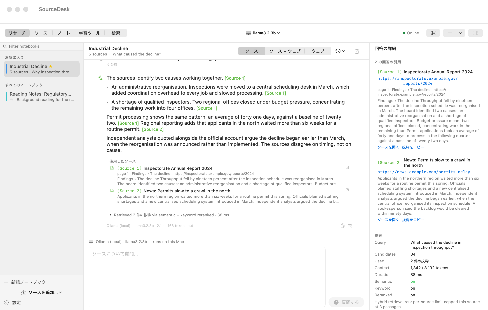

# SourceDesk

macOS 向けの、ローカル優先の AI リサーチノートブックです。ウェブサイト、PDF、文書、
貼り付けたテキストをソースとして集め、すべてを手元の Mac に置いたまま、**引用を確認できる**
形で自分の資料から質問に答えます。

[English README is here](README.md)

SourceDesk は独立したプロジェクトです。文書に基づいて答える AI アシスタントという
一般的な考え方に着想を得ていますが、Google NotebookLM その他の製品のコード、アセット、
プロンプト、ブランドを含みません。

## ダウンロード

**[最新の SourceDesk.dmg をダウンロード](https://github.com/Sumi1124/Source-Desk/releases/latest)**

ディスクイメージを開き、**SourceDesk** をアプリケーションフォルダにドラッグして起動します。

> **初回起動は macOS に止められます。** このアプリは Apple の公証を受けていません
> （有料の Developer ID が必要で、このプロジェクトは持っていません）。表示される
> ダイアログは 2 種類あり、対処法が異なります。どちらもターミナルや追加インストールは
> 不要です。
>
> 1. *「開発元を確認できないため開けません」* → **アプリを右クリック（または Control
>    キーを押しながらクリック）→「開く」→「開く」**。1 回だけで十分です。
> 2. *「壊れているため開けません。ゴミ箱に入れる必要があります」* → このダイアログには
>    「開く」ボタンがありません。**システム設定 → プライバシーとセキュリティ** を開き、
>    **セキュリティ** の欄で SourceDesk のメッセージの横にある **「このまま開く」** を
>    クリックしてから、通常どおり起動します。
>
> プライバシーとセキュリティに項目が出ない場合は、どちらの場合も右クリック →「開く」が
> 使えます。ディスクイメージ内の `Read Me First.txt` にも同じ内容が書かれています。
>
> ターミナルを使いたい場合のみ:
> `xattr -dr com.apple.quarantine /Applications/SourceDesk.app`

macOS 14 (Sonoma) 以降が必要です。**Apple シリコンと Intel の両方**で動作します
（配布イメージはユニバーサルバイナリです）。


---

## はじめかた

1. **アプリを開きます。** 初回起動時に 4 ステップの案内が表示されます。データの扱い、
   使うモデルの選択、最初のノートブックの作成、次にできることの順です。Ollama の有無は
   決めつけずに検出し、いつでもスキップできます。**ヘルプ → SourceDesk ヘルプ** から
   いつでも開き直せます。

2. **モデルを選びます。**
   - *ローカル（無料・プライベート・オフライン）:* [Ollama](https://ollama.com) を
     インストールし、`ollama pull llama3.2` を実行します。初回の案内が自動で検出します。
   - *Ollama のホスト版 API:* 手元の Mac では大きすぎるモデルを利用できます。
     [ollama.com/settings/keys](https://ollama.com/settings/keys) でキーを作成します。
     無料枠には月ごとの利用上限があり、大きなモデルは課金対象です。
   - *OpenAI / Anthropic:* 設定で API キーを貼り付けます。キーは macOS キーチェーンに
     保存され、ファイルには書き込まれません。

   いつでも、会話ごとに変更できます。

3. **ソースを追加します。** URL を貼り付ける、ファイルをドラッグする、あるいは
   トピックを書いて SourceDesk にページを探させて承認する、のいずれかです。

4. **質問します。** 回答は使用した抜粋を引用します。引用をクリックすると、その文脈を
   読むことができます。


---

## できること

- **追加量に上限はありません。** ウェブサイト、PDF、DOCX、RTF、EPUB、Markdown、HTML、
  貼り付けたテキストを、ディスクの許すかぎり追加できます。ソース数、ノートブック数、
  合計サイズに製品上の上限はありません。暴走したファイルからディスクを守るための個別の
  安全上限はあります（取り込む文書は 1 件 512 MB、ウェブページは 25 MB、いずれも
  設定 → 詳細 で変更可。トピック検索 1 回で取得するのは最大 8 ページ）。上限を超えた
  ファイルは理由とともに拒否され、黙って切り詰められることはありません。
- **ソースに根拠を置いた回答と引用。** 回答は使用した抜粋を引用し、引用をクリックすると
  出典、ページ、セクション、抜粋が開きます。取得した抜粋に結び付かない引用記号は
  表示せずに取り除きます。モデルが何も引用せずに答えた場合は、根拠があるように見せず、
  その旨を回答の上に表示します。
- **ローカル優先。** ノートブック、ソース、抽出テキスト、分割、ベクトル、会話、ノート、
  設定はすべて Mac 上の 1 つのフォルダに保存されます。SourceDesk 自身は何もアップロード
  しません。ローカルモデルを選べば、何も Mac から出ません。
- **ローカル / ホスト / クラウドのモデル。** 手元の Ollama、ollama.com のホスト版
  （Mac では大きすぎるモデル向け）、OpenAI、Anthropic Claude。会話ごとに切り替えられ、
  ソースの内容が Mac から出る前に対象ノートブックごとの確認があります。
- **任意のウェブ検索。** ノートブックのみ、ノートブック + ウェブ、ウェブのみ。
  ウェブの結果は自分のソースとは別ものとして明示されます。
- **オフラインモード。** ネットワーク接続なしで、ソースの閲覧、ローカル検索、
  ローカルモデルとの対話、ノートの生成ができます。
- **学習ツール。** 11 種類の生成機能: 要約、要点、年表、FAQ、クイズ、単語カード、
  学習ガイド、アウトライン、引用集、ソース比較、ブリーフィング。クイズと単語カードは
  構造化して出力されるため、アプリ内でそのまま演習できます。
- **オープンな書き出し形式。** ノートブックは `.nbk` として書き出されます。`unzip` や
  任意のテキストエディタで開ける単純な zip です。

## スクリーンショット

以下はすべて、macOS 上で実際の SwiftUI ビューから、実際のウィンドウサイズで、タイトルバー
とツールバーを含めて描画したものです。ダークモード版は
[`docs/screenshots/`](docs/screenshots) に `-dark` を付けて収録しています。アプリは
システムの外観に追従します。**`12-research-japanese.png` と `12-sources-japanese.png`
は日本語表示の実例です。**

| | |
|---|---|
|  |  |
| 出典から引用した回答 | ソースの管理 |
|  |  |
| 引用の詳細と出所 | 学習ツール |
|  |  |
| モデルの設定 | 日本語の表示 |

---

## 必要な環境

- macOS 14 (Sonoma) 以降
- ビルドする場合: **Command Line Tools**（`xcode-select --install`）と Swift 6.0 以降
  （6.2.3 で確認）。**Xcode は不要です。** 本プロジェクトはマクロを使う API を意図的に
  避けており、`swift build` は Command Line Tools だけで動きます。
- 任意: ローカルモデル用の [Ollama](https://ollama.com)
- 任意: OpenAI / Anthropic、検索プロバイダの API キー

## 表示言語

設定 → 外観 → **表示言語** で、**システム / English / 日本語** から選べます。
**再起動は不要で、すぐに切り替わります。**「システム」を選ぶと macOS の言語設定に
追従します。

翻訳はアプリに組み込まれているため、実行時に言語ファイルを読み込む必要がありません。
未訳の文字列は英語のまま表示されます（キー名や空白になることはありません）。

## 使いこなす

### ローカルモデルの準備

```bash
brew install ollama          # または ollama.com からダウンロード
ollama serve                 # まだ起動していない場合
ollama pull llama3.2         # 約 2 GB。ノート規模の質問には十分
ollama pull nomic-embed-text # 任意: セマンティック検索の精度が上がります
```

その後、ツールバーで **Ollama** を選び、必要なら埋め込みも設定します。
アプリはモデルの一覧を実際に問い合わせるため、存在しないモデルを前提にすることは
ありません。

### トピックからソースを探す

設定 → 検索 で検索プロバイダを選び、ソース画面の **「トピックからソースを探す」** に
調べたいことを入力します。

1. 検索が候補を集めます。
2. 選択中のモデルが、取得する価値のあるものを選びます。
3. **あなたが承認するまで何もダウンロードされません。** 結果はタイトルと URL とともに
   表示され、チェックを外せます。AI の選択が間違っていたらここで直せます。

あなたのトピックと検索結果のタイトルは、選択のため選択中のモデルに送信されます。
**ローカルのみモードが有効なとき、またはそのノートブックでクラウド利用を承認していない
ときは、モデルには送信されません** — 代わりに上位の結果をそのまま使い、その旨を結果の
上に表示します。

### Ollama のホスト版 API

[ollama.com/settings/keys](https://ollama.com/settings/keys) でキーを作成し、
設定 → AI プロバイダ → **Ollama Cloud** → *API キーを追加* の順に進みます。キーは他の
認証情報と同じくキーチェーンに保存されます。

実際のエンドポイントから分かった 2 点:

- **モデル一覧はキーなしで読めますが、生成にはキーが必要です。** そのため SourceDesk は
  キーを入れる前に何が存在するかを示し、生成にはキーが要ると明示します。空の一覧を
  見せることはしません。
- **ホスト版のモデルはダウンロードサイズを報告しません。** `size` は*非圧縮*の重みの
  大きさなので、ダウンロードサイズとして提示しません。カタログは `details` も空のため、
  SourceDesk はモデル名からパラメータ数を読み取りますが、名前に含まれない場合は
  何も表示しません（大半が該当します）。

それ以外はクラウドプロバイダと同じ扱いです。ノートブックごとの確認が必要で、
ローカルのみモードでは無効になり、オフラインでは拒否され、その回答は Mac から出たもの
として表示されます。

### クラウドプロバイダ

設定 → AI プロバイダ で、キーは **macOS キーチェーン** に保存されます。ノートブック、
設定ファイル、ログ、書き出しファイルには決して入りません。明確にしておきたい点:

- **ChatGPT Plus や Claude Pro の購読は API キーではありません。** SourceDesk は公式 API を
  使います。これらは各社により別途課金されます。アプリ内でもそう説明しており、誤解を
  招く表示はしていません。
- キーはこのアプリ専用として保存されます。ここで削除するとキーチェーンからも削除されます。

## 回答が根拠を保つしくみ

```
ソース → 取得/抽出 → 整形 → 分割 → 埋め込み → 保存 (SQLite + FTS5)
                                                        │
質問 ──► ハイブリッド検索（セマンティック + キーワードを統合） ─┘
          └─► 再ランク ─► 文脈の組み立て ─► モデル ─► 引用の検証 ─► 回答
```

1. **検索** はセマンティックなベクトル検索と SQLite FTS5 のキーワード検索を並行して
   実行し、順位を相互ランク融合で統合します。片方が使えなくなっても、検索が壊れるのでは
   なく再現率が下がるだけです。

   ここでいう「セマンティック」には注意点があります。既定の埋め込みはアプリ内蔵の
   **語彙ベース** のもので（単語、隣接 2 語、文字 4-gram をハッシュ化したベクトル）、
   ダウンロードもネットワークも不要にするために選ばれています。語の一致には強い一方で、
   言い換えには弱いです。設定 → 検索 で埋め込みを `nomic-embed-text`（または OpenAI の
   埋め込みモデル）に向けると、遠回しな質問での再現率が実質的に向上します。ベクトル検索は
   保存されたベクトルを厳密に走査する方式で、数万件の抜粋までは高速です（近似最近傍
   インデックスではありません）。

   規模についての検証: テスト 29 は 60 ソース・900 抜粋を実際のライブラリに取り込み、
   欠落も重複もないこと、検索が上限内に収まること、退化したクエリが扱えること、同じ
   ページを再追加しても二重にならず既存のソースに統合されることを検証します。

2. **再ランク** は語の網羅率、語句の近さ、見出しの一致で候補を採点し直します。ミリ秒単位で、
   モデルは使いません。モデルによる再ランクも利用でき、モデルが使えない場合は語彙ベースに
   戻ります。

3. **文脈の組み立て** が `[Source N]` / `[Web N]` の印を割り当てます。印は 1 か所だけで
   割り当てるため、引用が存在しない抜粋を指すことはありません。

4. **検証** は回答を走査し、取得した抜粋に解決できない印を取り除きます。モデルが存在しない
   資料を指す印を書いた場合、その印は表示されません。

## プライバシー

| 対象 | Mac から出るもの |
|---|---|
| ローカルモデル（同じネットワーク上のサーバを含む） | 何も出ません。モデル、埋め込み、索引のすべてが自分が管理する機器で動きます。 |
| Ollama のホスト版、OpenAI、Anthropic | 取得した抜粋と質問が、選択したプロバイダに送信されます。 |
| ウェブ検索 | 検索クエリが、選択した検索プロバイダに送信されます。 |
| トピックからソースを探す | トピックと返ってきた結果のタイトルが、関連性の判断のため選択中のモデルに送信されます。ローカルのみモードが有効なとき、またはそのノートブックでクラウドモデルを承認していないときは、モデルを使わず上位の結果をそのまま使います。その旨は結果の上に表示されます。 |
| ページの取得 | ページの URL が、そのサイト自身に送信されます。`SourceDesk/1.0` というユーザーエージェントが、このリポジトリを指します。 |
| それ以外 | 何も出ません。テレメトリ、解析、アカウント、更新確認の通信はありません。 |

すべては `~/Library/Application Support/SourceDesk/` に保存されます。`library.sqlite` と、
保存したテキストが入る `content/` フォルダです。どこにも同期しません。

完全に削除するには: SourceDesk を終了し、アプリをゴミ箱に入れ、上記のフォルダを
削除してください。

設定 → プライバシー にはこの内容がライブで表示され、クラウド利用を承認したノートブックと、
それぞれの取り消しボタンも並びます。詳細は
[docs/ARCHITECTURE.md](docs/ARCHITECTURE.md#privacy-model)（英語）にあります。

## 読み込みと書き出し

ノートブックは `.nbk` として書き出します。中身は単純な zip で、任意のツールで開けます。
API キーとアプリ設定は決して含まれません。読み込みは常に固有の新しいノートブックを
作るため、二度読み込んでも既存の作業が上書きされることはありません。

## キーボードショートカット

| キー | 動作 |
|---|---|
| ⇧⌘N | 新規ノートブック |
| ⌘K | コマンドパレット |
| ⌘F | ノートブックの絞り込み（サイドバーの検索欄） |
| ⌘↩ | 質問を送信 |
| ⌘, | 設定 |

## 開発

### ビルド

```bash
scripts/build_app.sh release     # build/SourceDesk.app を組み立てます
open build/SourceDesk.app
```

ビルド済みバイナリはタグ付きリリースと、手動の **Actions → Build and test** 実行に
添付されます。通常の push と pull request はテストのみを実行します
（`.github/workflows/build.yml` を参照）。`SourceDesk.app` を `/Applications` に移動し、
初回は上の [ダウンロード](#ダウンロード) の注意に従って起動してください。

### リリースの作成

```bash
git tag -a v1.2.0 -m "SourceDesk 1.2.0"
git push origin v1.2.0
```

CI がユニバーサルバイナリをビルドし、DMG を作成してリリースに添付します。バージョンは
`git describe --tags` から読むため、アプリ内のバージョンとリリースが食い違うことは
ありません。

### 署名と公証

配布しているアプリは **ad-hoc 署名** であり、Developer ID による署名ではないため、初回
起動時に macOS のダイアログが表示されます（[ダウンロード](#ダウンロード) を参照）。これは
見落としではなく、意図した制約です。Developer ID 証明書は Apple が有料の Developer
Program アカウントに発行し、アプリを確認済みの法的身元に結び付けます。Gatekeeper は
Apple の証明書チェーンに対して署名を検証するため、ローカルで作った証明書は ad-hoc 署名と
まったく同じように拒否されます。警告が消えることはありません。

`scripts/sign_and_notarize.sh` は、認証情報がある場合は実際に署名し、ない場合は何が
足りないかとその入手方法を具体的に表示します:

```bash
scripts/sign_and_notarize.sh                          # Developer ID があれば署名
SOURCEDESK_NOTARIZE=1 scripts/sign_and_notarize.sh    # 署名 + 公証 + ステープル
```

以下のリポジトリシークレットを設定すると、コードを変更せずに CI が自動で署名と公証を
行います:

| シークレット | 内容 |
|---|---|
| `MACOS_CERTIFICATE_P12` | Keychain Access から書き出した `.p12` を base64 にしたもの |
| `MACOS_CERTIFICATE_PASSWORD` | その書き出しのパスワード |
| `MACOS_KEYCHAIN_PASSWORD` | 任意の値。CI の一時キーチェーン用 |
| `MACOS_NOTARY_APPLE_ID` | 公証も行う場合の Apple ID |
| `MACOS_NOTARY_TEAM_ID` | チーム識別子 |
| `MACOS_NOTARY_PASSWORD` | appleid.apple.com で発行する App 用パスワード |

証明書がない場合、CI はその旨を表示して続行します。署名していないのに署名したとは
決して報告しません。

### テスト

```bash
scripts/test.sh                        # すべてのスイート
scripts/test.sh -f "6 ·"               # 1 つのスイートまたはテスト
scripts/test.sh --release              # アプリバンドルとディスクイメージも検証
SOURCEDESK_LIVE_WEB=1 scripts/test.sh  # 公開インターネットも使う
```

`scripts/test.sh` は CI のゲートで、失敗すると非ゼロで終了します。古いバイナリを使うと
結果が意味を失うため、まずハーネスをビルドします。テストが `swift test` ではなく
実行ファイルに入っている理由は [テストの方針](#テストの方針) を参照してください。

## テストの方針

このプロジェクトは**実際に動くこと**を重視し、その方針をそのまま公開しています。

```
PASS  29 suites · 269 tests · 1440 assertions · 0 failures · 265 verified

NOT VERIFIED (4 — この環境では実行できませんでした):
  ~ 20 · 実ローカルモデル → 実際のモデルがソースから答え、引用する
      ローカルの Ollama モデルが入っていないため、実モデルでの根拠ある回答は未検証です
```

`265 verified` は `0 failures` とは別の主張です。前者は「これだけが実際に動いた」を意味し、
後者は「失敗しなかった」を意味します。何も実行していなければ後者は自動的に真になります。
検証できなかったものを数を水増しするために省略することはせず、上のように報告します。

**テストが `swift test` ではない理由。** このマシンには Xcode がなく、XCTest も
SwiftData のマクロも使えません。そのためテストは `SourceDeskHarness` という実行ターゲットに
あり、自前の `TestKit` を使います。これは制約から来た設計ですが、副次的に利点もあります。
ハーネスはライブラリを直接操作できるので、終わったものを片付けるテストではなく、
実際の状態を確かめるテストが書けます。

**テストが失敗しうることを確かめます。** 赤になりえないテストは、緑でも何も証明しません。
ゲートや検証を追加したときは、対象のコードを一時的に無効にして、狙った表明が実際に
失敗することを確認してから戻します。プライバシーゲートではこれを行い、7 件中 5 件が
失敗し、実際にリクエストが送信されていたこと（「expected 0, got 2」）を示しました。

**パッケージングもテストします。** `scripts/test.sh --release` はバンドルとディスク
イメージを組み立てて検査します。Info.plist が解析でき必要な項目を宣言していること、
カメラ・マイク・位置情報の権限を要求していないこと、イメージがマウントできること、
同梱のバイナリがビルド元と一致すること、初回起動の説明が入っていること、そして
リリースが Apple シリコン専用ではなくユニバーサルバイナリであることを確認します。
パッケージングは普段はリリース当日にしか動かないため、壊れたことに気づくのが最悪の
タイミングになりがちです。

**アクセシビリティは実際のウィンドウに対して検証します。**
`SourceDesk --audit-accessibility` は Accessibility API で実際のウィンドウを走査し、
アプリが持つコントロールに読み上げ名がない場合に失敗します。これはソースを読んでも
分かりません。ツールチップ付きのアイコンだけのボタンは、見た目はラベルがあるように
見えて何も読み上げません（`.help()` はアクセシビリティラベルではないためです）。
実際にこれを見つけました。ツールバーのセクション切り替えが「Research」ではなく
`bubble.left.and.text.bubble.right` と読み上げられていました。

**読みやすさは測ります。** `scripts/contrast_check.swift` は文字と背景のコントラスト比を
WCAG に沿って測定します。読みやすさは計算できるものなので、目視ではなく数値で確認します。
サイドバーのタイトルが、その下の説明文よりも薄いという不具合は、測定値が 1.90:1 対
4.80:1 だったことで見つかりました。

## プロジェクトの構成

```
Sources/
├── CZlib/                  zlib の薄いラッパ（システムライブラリ）
├── SourceDeskCore/         UI を含まない本体。ハーネスから直接リンクできます
│   ├── AI/                 プロバイダ（Ollama、Ollama Cloud、OpenAI、Anthropic）
│   ├── Ingestion/          取得、HTML 抽出、文書の解析
│   ├── Localization/       日本語の文字列テーブルと L() の仕組み
│   ├── RAG/                分割、埋め込み、ハイブリッド検索
│   ├── Search/             ウェブ検索とトピックからのソース探索
│   └── Settings/           設定、オンボーディングの方針
└── SourceDesk/             SwiftUI アプリ
    ├── App/                入口、アプリの状態、スクリーンショットの描画
    └── Views/              画面
Tests/Harness/              検証ハーネス（29 スイート）
scripts/                    ビルド、テスト、パッケージング、測定
docs/                       設計文書とスクリーンショット
```

## 貢献

[CONTRIBUTING.md](CONTRIBUTING.md)（英語）を参照してください。
`scripts/test.sh` が通ることが条件です。

## ライセンス

MIT。[LICENSE](LICENSE) を参照してください。

SourceDesk は独立したプロジェクトです。Google NotebookLM その他の製品と提携しておらず、
それらのアセットやコードを含みません。
