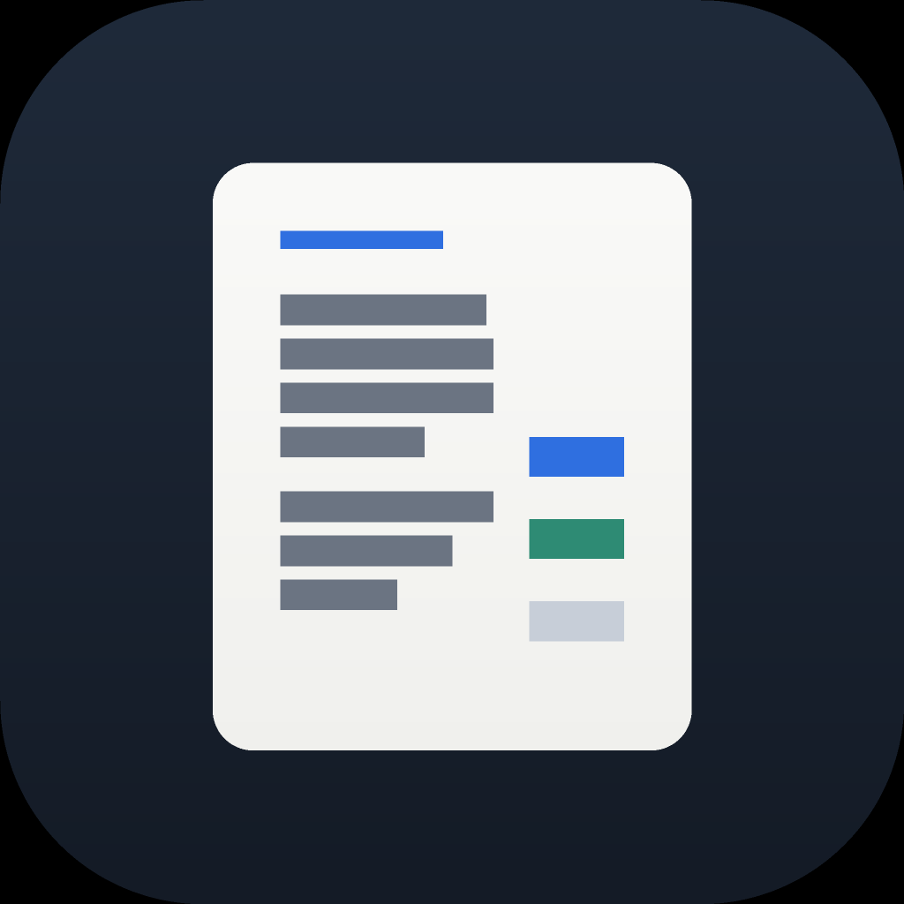

# SourceDesk

A local-first AI research notebook for macOS. Collect sources — websites, PDFs,
documents, pasted text — keep everything on your Mac, and ask questions that are
answered from your material **with citations you can inspect**.

SourceDesk is an independent project. It is inspired by the general idea of
document-grounded AI assistants, but contains no code, assets, prompts or branding
from Google NotebookLM or any other product.

## Download

**[Download the latest SourceDesk.dmg](https://github.com/Sumi1124/Source-Desk/releases/latest)**

Open the disk image, drag **SourceDesk** into your Applications folder, and launch it.

> **The first launch is blocked by macOS.** The app is not notarised by Apple — that
> requires a paid Developer ID, which this project does not have. There are two dialogs and
> they need different answers; neither needs Terminal or anything installed:
>
> 1. *"cannot be opened because the developer cannot be verified"* → **right-click (or
>    Control-click) the app → Open → Open**. Once.
> 2. *"is damaged and can't be opened. You should move it to the Trash"* → this dialog has
>    no Open button. Go to **System Settings → Privacy & Security**, scroll to **Security**,
>    and click **Open Anyway** next to the SourceDesk message. Then launch it normally.
>
> If neither line appears in Privacy & Security, right-click → Open works for case 2 as
> well. The `Read Me First.txt` inside the disk image says the same thing.
>
> Only if you prefer a terminal: `xattr -dr com.apple.quarantine /Applications/SourceDesk.app`

Requires macOS 14 (Sonoma) or later, on **Apple silicon or Intel** — the release image is a
universal binary.

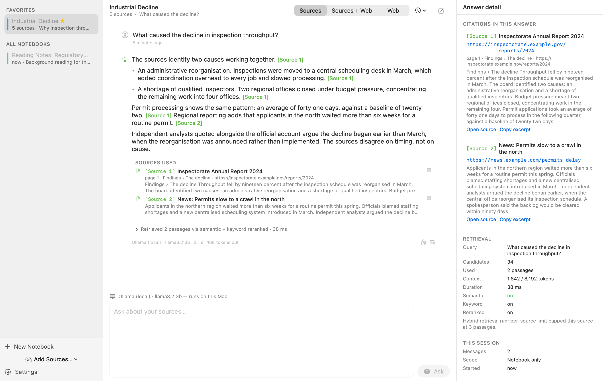

---

## Getting started

1. **Open the app.** The first launch walks you through four short steps: what SourceDesk
   does with your data, which model to talk to, creating your first notebook, and what to do
   next. It detects Ollama on your Mac rather than assuming it is there, and it is skippable
   at every point. Re-open it any time from **Help → SourceDesk Help**.

2. **Choose a model.**
   - *Local (free, private, offline):* install [Ollama](https://ollama.com) and run
     `ollama pull llama3.2`. The welcome flow detects it automatically.
   - *Ollama's hosted API:* models too large for your Mac, at
     [ollama.com/settings/keys](https://ollama.com/settings/keys). Free tier available.
   - *OpenAI or Anthropic:* paste an API key in Settings. Keys go to the macOS Keychain,
     never to a file.

   You can change this at any time, per conversation.

3. **Add sources.** Paste a URL, drag in files, or describe a topic and let SourceDesk find
   pages for you to approve.

4. **Ask questions.** Answers cite the passages they used. Click a citation to read it in
   context.

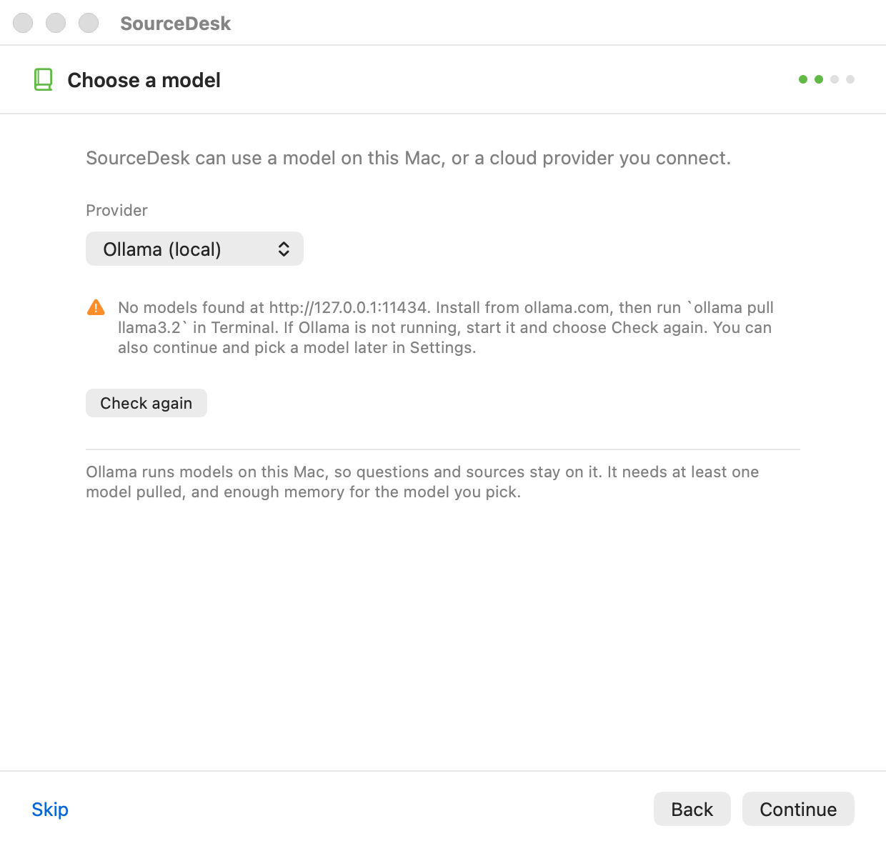

---

## What it does

- **No cap on how much you add.** Add as many websites, PDFs, DOCX, RTF, EPUB,
  Markdown, HTML or pasted-text sources as your disk allows — there is no limit on
  source count, notebook count or total library size. Individual safety limits stop a
  runaway file from filling the disk: 512 MB per imported document, 25 MB per web page
  (both configurable in Settings → Advanced), and at most 8 pages downloaded in one
  topic search. A file over its limit is refused with an explanation, never silently
  truncated.
- **Answers grounded in your sources, with citations.** Answers cite the passages
  they used, and clicking a citation opens the source, the page, the section and the
  excerpt behind it. A marker that does not resolve to a retrieved passage is stripped
  rather than shown. When a model answers without citing anything, the app says so
  above the answer instead of presenting it as grounded.
- **Local-first.** Notebooks, sources, extracted text, chunks,
  vectors, conversations, notes and settings all live in one folder on your Mac.
  Nothing is uploaded by SourceDesk itself. Choose a local model and nothing leaves
  the machine at all.
- **Local, hosted or cloud models.** Ollama on your Mac, Ollama's hosted API at
  ollama.com (for models too large to run locally), OpenAI, or Anthropic Claude.
  Switchable per conversation, with an explicit per-notebook confirmation before any
  source text leaves the Mac.
- **Optional web search.** Notebook only, notebook + web, or web only — with web
  results always labelled separately from your sources.
- **Offline mode.** Read sources, search locally, chat with a local model and
  generate notes with no network connection.
- **Study tools.** Eleven generators: summary, key points, timeline, FAQ, quiz,
  flashcards, study guide, outline, quotations, source comparison and briefing. Quiz
  and flashcard output is structured, so the app can run them interactively.
- **Open export format.** Notebooks export to a plain `.nbk` zip you can read with
  `unzip` and any text editor.

## Screenshots

Every screenshot below is rendered from the app's real SwiftUI views on macOS, at real
window sizes with the title bar and toolbar included. Dark-mode variants of all of them
are in [`docs/screenshots/`](docs/screenshots) with a `-dark` suffix — the app follows the
system appearance throughout.

These are generated by the app itself (`SourceDesk --render-screenshots <dir>`), not
captured by hand, so they cannot drift from what the app actually draws.

| | |
|---|---|
| 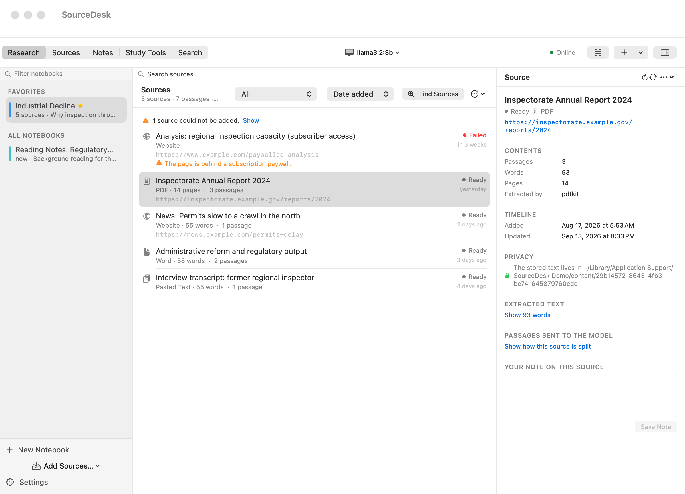 **Source management** — status, size, passages | 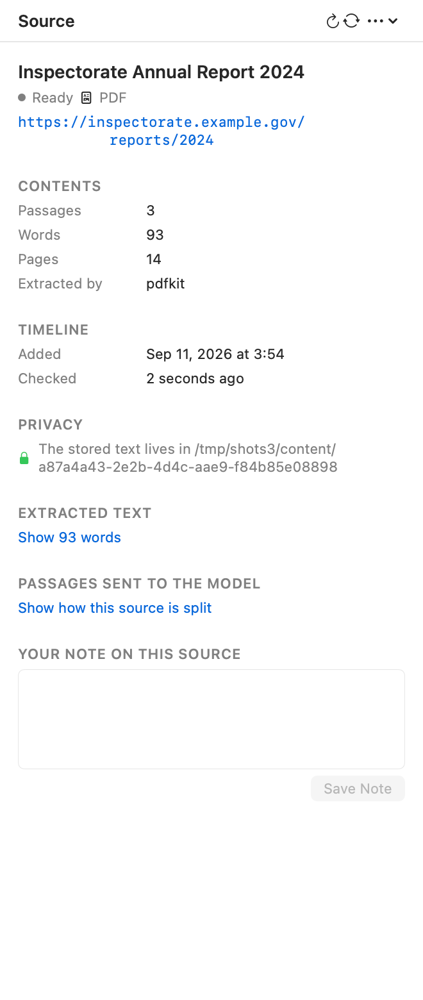 **Inspector** — provenance, extracted text, passages |
| 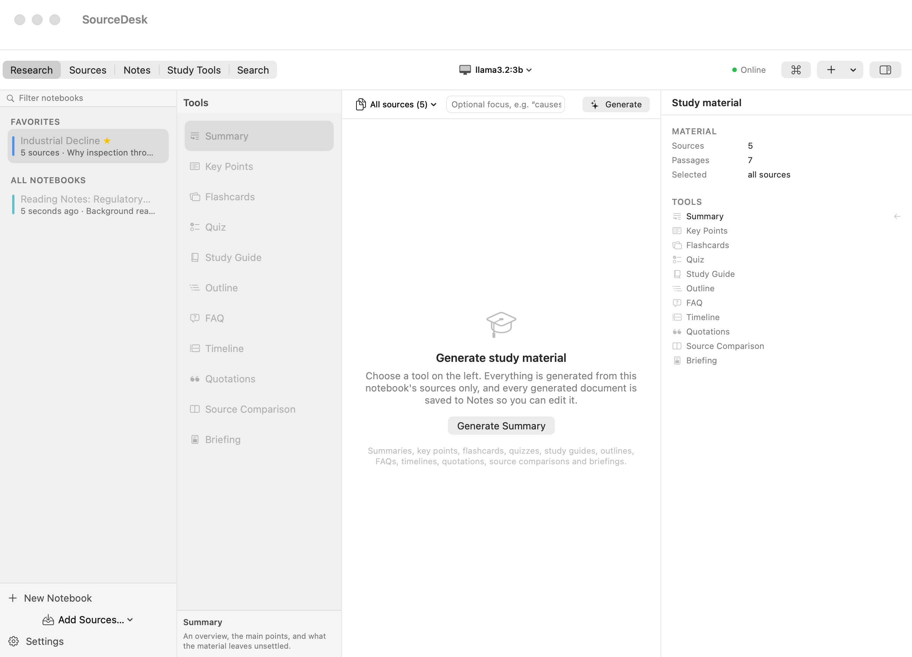 **Study tools** — eleven generators | 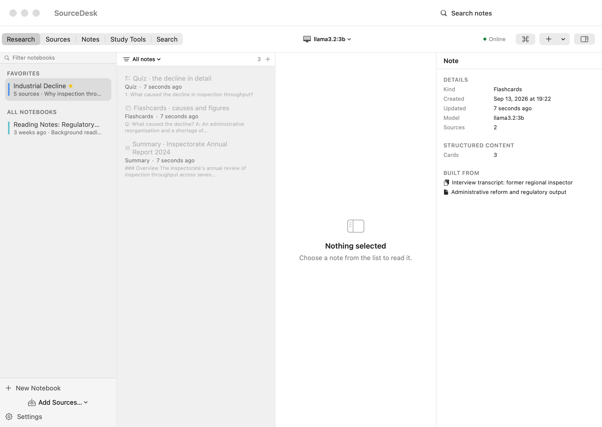 **Notes** — flashcards and quizzes you can run |
| 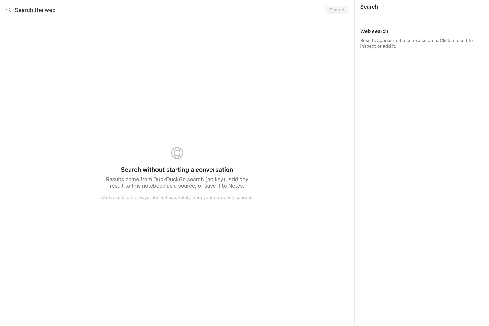 **Web search** — results you can add as sources | 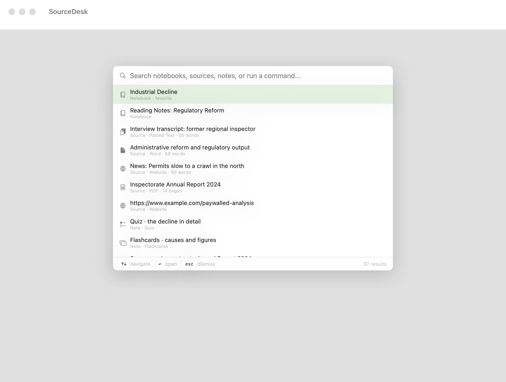 **Command palette** — ⌘K across everything |
| 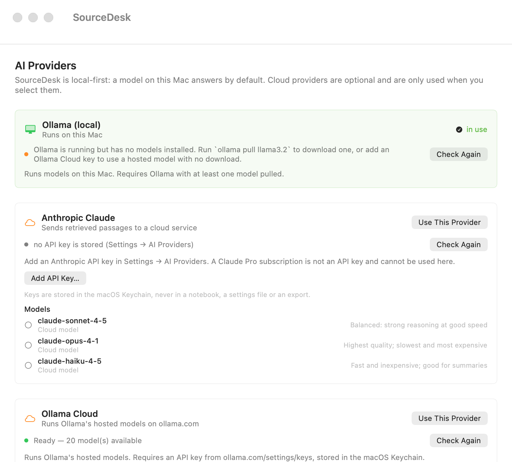 **Providers** — local first, cloud optional | 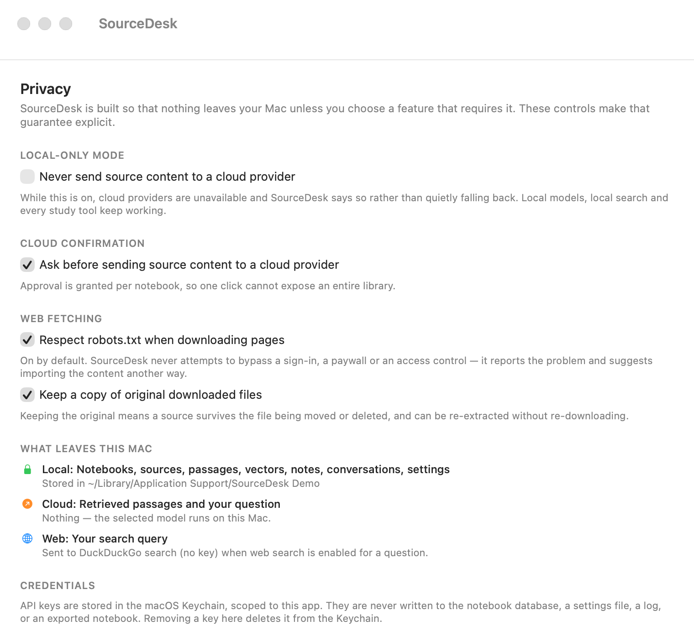 **Privacy** — what leaves the Mac, stated plainly |

These are rendered from the app's own views by `SourceDesk --render-screenshots`;
regenerate them with `scripts/screenshots.sh`.

## Requirements

- macOS 14 Sonoma or later
- To build: the **Command Line Tools** (`xcode-select --install`) and Swift 6.0+
  (verified with 6.2.3). Full Xcode is **not** required — this project deliberately
  avoids macro-based APIs, so `swift build` works with the Command Line Tools alone.
- Optional: [Ollama](https://ollama.com) for local models
- Optional: API keys for OpenAI, Anthropic, and/or a search provider

## Using it

#### Setting up a local model

```bash
brew install ollama          # or download from ollama.com
ollama serve                 # if it is not already running
ollama pull llama3.2         # ~2 GB, fast and capable for note-sized questions
ollama pull nomic-embed-text # optional: better semantic search
```

Then choose **Ollama** in the toolbar and (optionally) set embeddings to
*Local model* in Settings → Retrieval.

#### Research a topic

Command palette (⌘K) → **Research & Add Sources…**, or the **+** menu in the toolbar.
Give it a topic and SourceDesk searches the web, downloads the top results and indexes
them as ordinary sources — downloaded, extracted, cleaned, chunked and embedded, exactly
like a page you pasted in yourself. **Research & Write a Note…** does the same and then
writes a summary note from what it found.

It deliberately does *not* do:

- **It never builds a source out of a search snippet.** A snippet is a fragment of a
  results page, not the author's text, so treating it as the source would mean citing
  words the source never wrote. Every researched source is the real page or it is
  reported as a failure.
- **It never saves an empty source.** If a page cannot be downloaded, or downloads but
  yields no readable text, it is marked failed with an explanation rather than appearing
  in the sidebar as a source that cites nothing.

A run over several pages is cancellable, shows progress per page, and keeps whatever it
already indexed when cancelled.

#### Ollama's hosted API

Ollama serves one API from two places: a server on your Mac, and `https://ollama.com`,
where the same `/api/tags`, `/api/chat` and `/api/embed` routes run models far too
large for a laptop (on 2026-09-13 the hosted catalogue listed 20 models, from 13 GB to
over 1.5 TB of uncompressed weights). SourceDesk supports both.

To use it: create a key at [ollama.com/settings/keys](https://ollama.com/settings/keys),
then Settings → AI Providers → **Ollama Cloud** → *Add API Key*. The key goes in the
Keychain like every other credential.

Both facts below were read from the live endpoint rather than assumed:

- **The catalogue is readable without a key but generation is not.** SourceDesk
  therefore shows you what exists before you have a key, and tells you plainly that
  generation needs one — rather than showing an empty list.
- **Hosted models report no download size.** Their `size` field is the *uncompressed*
  weight, so it is never presented as a download. The catalogue also leaves `details`
  blank, so SourceDesk reads the parameter count from the model name — and shows none
  where the name does not carry one, which is most of them.

Everything else about it is a cloud provider: it requires the per-notebook
confirmation, it is disabled by Local-Only Mode, it is refused when you are offline,
and answers from it are labelled as leaving your Mac.

#### Cloud providers

Settings → AI Providers stores keys in the **macOS Keychain** — never in the
notebook, a settings file, a log or an export. Worth being clear about:

- A **ChatGPT Plus or Claude Pro subscription is not an API key**. SourceDesk uses
  the official APIs, which are billed separately by those vendors. The app says this
  in the UI rather than implying otherwise.
- Cloud use requires a **per-notebook confirmation** before any source text leaves
  the Mac, and **Local-Only Mode** disables cloud providers entirely.

## How answers stay grounded

```
Sources → download/extract → clean → chunk → embed → store (SQLite + FTS5)
                                                              │
Question ──► hybrid retrieval (semantic + keyword, fused) ─────┘
             └─► rerank ─► context assembly ─► model ─► citation validation ─► answer
```

1. **Retrieval** runs semantic vector search and SQLite FTS5 keyword search in
   parallel and merges the rankings with reciprocal-rank fusion, so losing either
   method degrades recall instead of breaking search.

   Verified at scale: suite 29 ingests 900 passages across 60 sources into a real library
and asserts nothing is lost or duplicated, that retrieval stays bounded, that a degenerate
query is handled, and that re-adding a page folds into the existing source rather than
doubling the corpus.

A caveat about "semantic" here: the default embedder is built in and **lexical** —
   hashed word, bigram and character 4-gram vectors — chosen so the app works with no
   download and no network. It matches wording well and paraphrases poorly. Point
   embeddings at `nomic-embed-text` (or an OpenAI embedding model) in Settings →
   Retrieval for materially better recall on indirect questions. Vector search is an
   exact scan over stored vectors, which is fast into the tens of thousands of chunks
   and is not an approximate-nearest-neighbour index.
2. **Reranking** re-scores candidates on term coverage, phrase proximity and heading
   agreement — in milliseconds, with no model. A model-based reranker is available
   and falls back to the lexical one if the model is unavailable.
3. **Context assembly** assigns `[Source N]` / `[Web N]` markers. Markers are
   assigned in exactly one place, so a citation can never refer to something that was
   not in the prompt.
4. **Validation** re-reads the answer, resolves every marker against the material
   that was actually supplied, and strips any marker that does not resolve. The
   retrieval trace (chunks, scores, timings) is stored with the message, so the
   "show your work" panel works even after a restart or an import.

## Privacy

| Scope | What leaves this Mac |
|---|---|
| Local model (including a server elsewhere on your own network) | Nothing. Model, embeddings and index all run on hardware you control. |
| Ollama's hosted API, OpenAI, Anthropic | The retrieved passages and your question, sent to your chosen provider. |
| Web search | Your search query, sent to your chosen search provider. |
| Find sources by topic | Your topic and the returned result titles, sent to your chosen model so it can judge relevance. With Local-Only Mode on, or with a cloud model not yet approved for the notebook, the model is skipped and the top results are used instead — the app says so above the results. |
| Fetching a page | The page URL, to the site itself, with a `SourceDesk/1.0` user-agent naming this repository. |
| Everything else | Nothing. No telemetry, no analytics, no accounts, no update pings. |

Everything lives in `~/Library/Application Support/SourceDesk/` — `library.sqlite` plus a
`content/` folder of the text you have stored. Nothing syncs it anywhere.

To remove it all: quit SourceDesk, drag it to the Trash, and delete that folder.

Settings → Privacy shows this table live, including which notebooks you have
approved for cloud use, with a revoke button for each. See
[docs/ARCHITECTURE.md](docs/ARCHITECTURE.md#privacy-model) for the details.

## Import and export

`⇧⌘E` exports the current notebook to a `.nbk` archive — a plain zip:

```
My Notebook/
├── notebook.json        notebook, sources, sessions, notes, chunks
├── sources/<id>/        content.txt, original files
├── chats/*.md           readable transcripts
├── notes/*.md           readable notes
└── embeddings/*.jsonl   optional vectors, so an import need not re-embed
```

`⇧⌘I` imports one, always as a **new** notebook, so importing twice can never
overwrite existing work. API keys and application settings are never included.

## Keyboard shortcuts

| | |
|---|---|
| ⇧⌘N | New notebook |
| ⌘K | Command palette |
| ⌘1 … ⌘5 | Research · Sources · Notes · Study Tools · Search |
| ⇧⌘U | Add website |
| ⇧⌘O | Add files |
| ⇧⌘E / ⇧⌘I | Export / import notebook |
| ⇧⌘R | Refresh model lists |
| ⌘↩ | Ask |
| ⌘. | Stop generating |
| ⌘F | Filter notebooks (sidebar) |

## Development

### Building

```bash
scripts/build_app.sh release     # assembles build/SourceDesk.app
open build/SourceDesk.app
```

Prebuilt binaries are attached to tagged releases and to manual **Actions → Build and
test** runs; ordinary pushes and pull requests run the tests only
(see `.github/workflows/build.yml`). Move `SourceDesk.app` to `/Applications`, then launch
it once per the [Download](#download) note above.

```bash
git clone https://github.com/Sumi1124/Source-Desk.git
cd Source-Desk
swift build -c release
open .build/release/SourceDesk
```

`scripts/build_app.sh` wraps the built binary in a proper `.app` bundle (Info.plist,
icon, ad-hoc signature) so it behaves like a normal Mac application. The icon is
generated by `scripts/generate_icon.py` using only the Python standard library.

### Making a release

```bash
scripts/build_app.sh release     # build/SourceDesk.app
scripts/build_dmg.sh 1.0.0       # build/SourceDesk-1.0.0.dmg
```

The disk image contains the app, an `/Applications` drop target and a short read-me about
the first-launch step, so installing is: open the image, drag the app across.

Packaging uses **only `hdiutil` and `codesign`** — both ship with macOS. No `create-dmg`,
no Homebrew, nothing to install, which keeps a release reproducible on any stock Mac. The
`-dmg` script verifies its own output by mounting the image and checking the app inside it
is present, runnable and identical to the build it was made from; a broken image fails at
build time rather than after someone downloads it.

The release image is a **universal binary**. `swift build --arch arm64 --arch x86_64` needs
`xcbuild`, which only ships with full Xcode, so when that is unavailable
`build_app.sh` cross-compiles each architecture separately with `--triple` (which the
Command Line Tools can do) and fuses the two slices with `lipo`. Either route produces a
build that runs on both Apple silicon and Intel. A tagged `v*` push makes GitHub Actions
build the image and attach it to a Release.

There are **no third-party dependencies**. SourceDesk uses SwiftUI, AppKit, PDFKit
and Network, plus SQLite and zlib, which ship with macOS. Vector search, keyword
search (SQLite FTS5), HTML extraction and readability scoring, DOCX/EPUB/RTF
parsing, zip archives and SHA-256 are implemented in the repository (PDF text
extraction goes through Apple's PDFKit), which is why the app builds offline
and has no supply chain to audit.

### Testing

```bash
scripts/test.sh                        # all suites
scripts/test.sh -f "6 ·"               # one suite or test
scripts/test.sh --release              # also verify the app bundle and the disk image
SOURCEDESK_LIVE_WEB=1 scripts/test.sh  # also exercise the public internet
```

`scripts/test.sh` is the CI gate and exits non-zero on failure. It builds the harness
first, because using a stale binary is a real failure mode this project has hit. See
[Testing approach](#testing-approach) for why the tests live in an executable rather
than `swift test`.

## Testing approach

This project's testing is unusual in two ways, both deliberate.

**The tests are an ordinary executable, not `swift test`.** Apple's Command Line
Tools ship without the XCTest and swift-testing bundles, and without the macro
plugins SwiftData needs. The suites therefore live in `Tests/Harness` and run via
`swift run SourceDeskHarness`, with a small assertion framework in
`Tests/Harness/TestKit.swift`. This keeps the whole project buildable and *testable*
with only the Command Line Tools, and the harness reports the same pass/fail detail
`swift test` would.

**Provider behaviour is tested against a real HTTP server.** `LocalHTTPServer` in the
harness is a small socket server; the Ollama, OpenAI and Anthropic providers are
exercised with real `URLSession` requests, real streaming, real status codes and real
error bodies. That is what catches the bugs that matter — a mis-parsed SSE line, a
missing header, a multi-byte character split across a stream chunk — which a mocked
transport would not.

The suites cover persistence and restart, HTML extraction, chunking, embeddings,
hybrid retrieval, every provider's request/response shape and failure modes, web
search, study-tool parsing, export/import round trips, settings migration, offline
behaviour, and full product flows end to end (ingest → retrieve → answer → cite →
export → import → answer again).

**A test that cannot run is reported as unverified, never as a pass.** Tests needing a
real model or a live network skip with a reason, and the summary prints them separately:

```
PASS  28 suites · 262 tests · 1421 assertions · 0 failures · 258 verified

NOT VERIFIED (4 — these could not run in this environment):
  ~ 20 · Live local model → a real model answers from the sources and cites them
      no local Ollama model is installed, so grounded answering with a real model is unproven
```

`258 verified` is a different claim from `0 failures`:
most of the pipeline is tested with a stub provider, which says nothing about whether a
real model, given real retrieved passages, actually answers from them. Suite 20 answers
that question against **whatever Ollama has installed** — including the
anti-hallucination check, which asks a question the sources cannot answer and requires the
model to decline rather than invent a figure. Run `ollama pull llama3.2` and it runs for
real.

Suite 21 keeps that honest in the other direction: it drives the same assertions through a
scripted Ollama server, so a suite that only ever skips cannot quietly rot into something
that would fail the moment a model appeared.

**Packaging is tested too.** `scripts/test.sh --release` builds the bundle and the disk
image and then inspects them: that the Info.plist parses and declares what a Mac app
needs, that the app requests no camera/microphone/location entitlements, that the image
mounts, that the packaged binary is byte-identical to the build it came from, that the
image carries the read-me explaining the first-launch step, and that the release is a
universal binary rather than Apple-silicon only. A packaging step is otherwise only
exercised on release day, which is the worst time to find out it broke.

**Accessibility is tested against the running window.** `SourceDesk --audit-accessibility`
walks the real window through the Accessibility API and fails if any control the app owns
has no accessible name. This is not something source review can answer: an icon-only button
with a tooltip looks labelled and announces nothing, because `.help()` is not an
accessibility label. It found exactly that — the toolbar's section picker read out
`bubble.left.and.text.bubble.right` instead of "Research".

## Project layout

```
Sources/SourceDeskCore/     the engine: no UI, no AppKit
├── Ingestion/              HTML/PDF/DOCX/EPUB/RTF readers, web downloader, robots.txt
├── RAG/                    chunking, embeddings, hybrid retrieval, context assembly
├── AI/                     provider protocol, Ollama, OpenAI, Anthropic, prompts, engine
├── Search/                 search providers, reachability
├── Study/                  study-tool generators and output parsers
├── Export/                 .nbk archive format
└── Settings/               settings model, diagnostics log

Sources/SourceDesk/         the SwiftUI app
├── App/                    entry point, AppState, view models' host
├── ViewModels/             chat and study-tool view models
└── Views/                  sidebar, research, sources, inspector, notes, settings

Tests/Harness/              verification suites (see above)
scripts/                    test, screenshot and release helpers
docs/                       architecture and format documentation
```

See [docs/ARCHITECTURE.md](docs/ARCHITECTURE.md) for the design and
[docs/NOTEBOOK_FORMAT.md](docs/NOTEBOOK_FORMAT.md) for the export format.

## Contributing

Issues and pull requests are welcome — see [CONTRIBUTING.md](CONTRIBUTING.md).
Please run `scripts/test.sh` before opening a PR.

## License

MIT — see [LICENSE](LICENSE).

SourceDesk is not affiliated with, endorsed by, or derived from Google NotebookLM,
OpenAI, Anthropic, Brave or Tavily. Provider and product names are trademarks of
their respective owners and are used only to describe interoperability.
